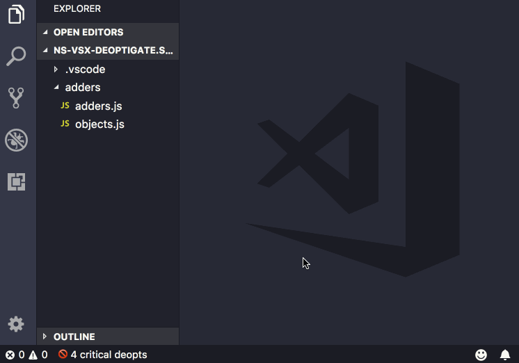

# ns-vsx-deoptigate README

This is the README for your extension "ns-vsx-deoptigate".




## Setup

Sample `launch.json` configuration using Node.js debugger (for now).
This adds a log file at `.vscode/deoptigate.log` where we expect it to be.

```json
{
  "version": "0.2.0",
  "configurations": [
    {
      "type": "node",
      "request": "launch",
      "name": "deoptigate",
      "program": "${workspaceFolder}/adders/adders.js",
      "runtimeArgs": [
        "--trace-ic",
        "--logfile=${workspaceFolder}/.vscode/deoptigate.log",
        "--nologfile-per-isolate"
      ]
    }
  ]
}
```
